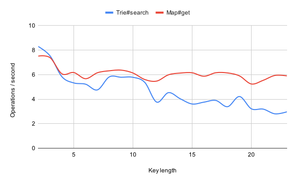

# trie

The compact trie data structure.

```shell
npm install --save-dev @smikhalevski/trie
```

## Usage

```ts
import {TrieMap} from '@smikhalevski/trie';

const trieMap = new TrieMap();

trieMap.set('foo', 123);

trieMap.get('foo'); // → 123

trieMap.search('aaafoobbb', 3);
// → {key: 'foo', value: 123, …}
```

## Performance

Clone this repo and use `npm ci && npm run perf` to run the performance testsuite.

### Search performance


